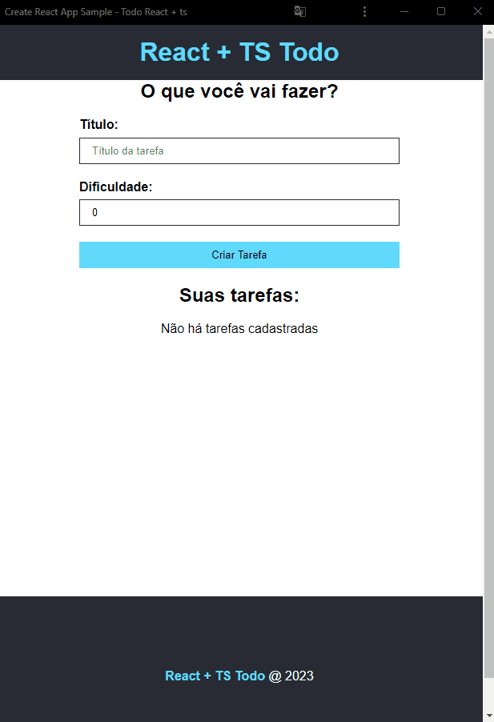

- Lista de tarefas.

- Demonstração:

<h1 align="center">
    
</h1>

- Tecnologias Usadas:

<ul>
    <li>HTML</li>
    <li>CSS</li>
    <li>JavaScript</li>
    <li>TypeScript</li>
    <li>React</li>
</ul>

